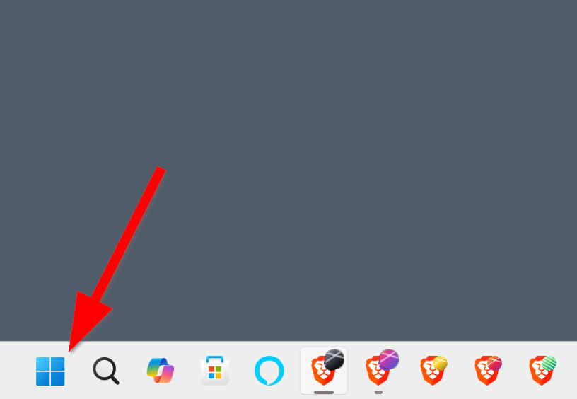
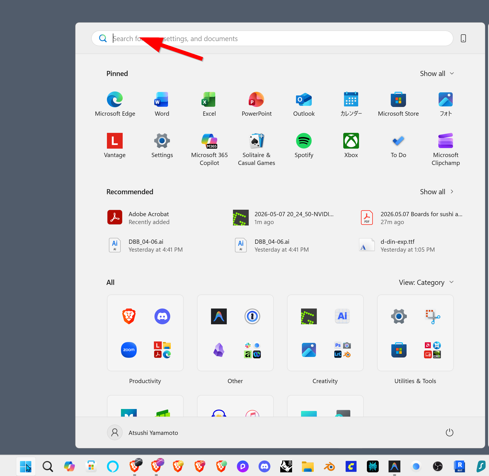
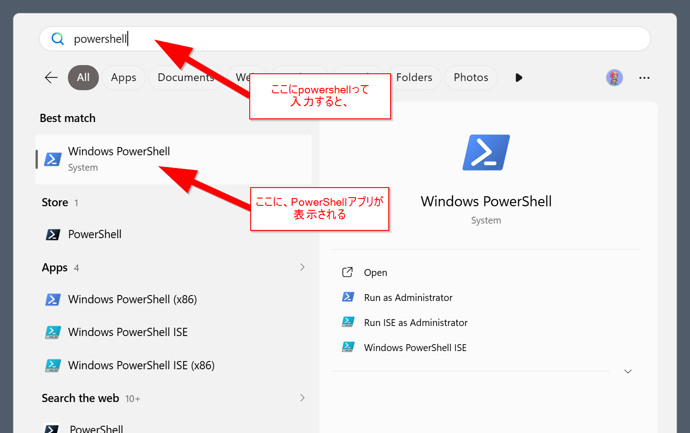
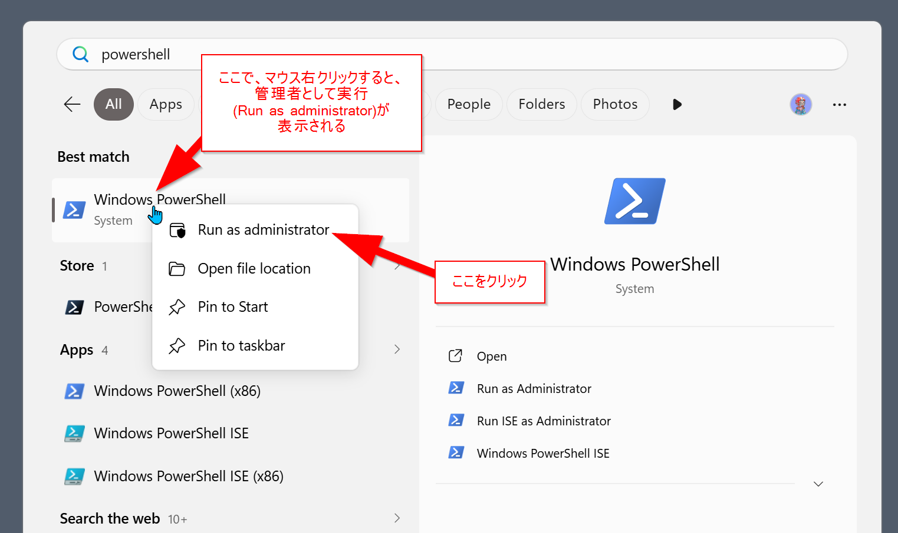

**web3 概論 2026 / homework week03 / sushi yam**

# Claude Code インストールマニュアル(Windows・初心者向け)

このマニュアルは、Windows 10 / 11 のパソコンに **Claude Code**(ターミナルで動く AI コーディングアシスタント)をインストールし、さらに Chiba Tech / Henkaku Center の **agent-logs**(セッションログ共有ツール)をセットアップするための手順書です。

---

## 📚 このマニュアルの読み方(2通り)

> **A. とにかくインストールだけ終わらせたい人**
> → 各ステップの **コマンド** と **✅成功サイン** だけを順に追えば完了します。所要時間 30〜60分。
>
> **B. 一つずつ理解しながら進めたい人**
> → 各所にある `▶ 📖 例えで詳しく理解する` をクリックすると、その操作が **何をしているのか** を例え話で解説します。

<details>
<summary>▶ 📖 このマニュアル全体を貫く「例え」</summary>

Windows という **家** の中に、Linux という **書斎** を増築し、その書斎にある **作業机(ターミナル)** で、**専属の共同作業者(Claude Code)** と一緒に原稿を書けるようにする ― これが、ここでやろうとしていることです。

書斎で書いた原稿は、いずれ **本棚(GitHub)** に納められ、**ショーケース(Vercel)** に並べられます。今回はその最初の2歩 ― **書斎を建てて、共同作業者を迎えに行く** ― です。

| 技術概念 | 例え |
|---|---|
| Windows | あなたの **家** |
| WSL2 | 家に増築する **書斎** |
| Ubuntu | 書斎の **内装** |
| ターミナル | 書斎の **作業机** |
| bash / zsh | 机での **作業ルール(方言)** |
| `~/.bashrc` | 朝、机に座る前に開く **備忘録** |
| Antigravity | AI助手つきの **執筆机ツール** |
| **Claude Code** | 専属の **共同作業者** |
| **agent-logs** | **研究ノート** |
| `curl ... \| bash` | **遠方の師匠が直送する道具一式を、その場で組み立てる** |
| `sudo` | 家の管理者の **印鑑** |
| **GitHub** | **本棚** |
| **Vercel** | **ショーケース** |

</details>

---

## 目次

1. [全体の流れ](#1-全体の流れ)
2. [必要なもの・前提条件](#2-必要なもの前提条件)
3. [ステップ1:WSL(Ubuntu)をインストールする](#3-ステップ1wslubuntuをインストールする)
4. [ステップ2:Ubuntu のターミナルを開く](#4-ステップ2ubuntu-のターミナルを開くantigravity-を使う方法)
5. [ステップ3:Ubuntu の初期設定](#5-ステップ3ubuntu-の初期設定)
6. [ステップ4:Claude Code をインストールする](#6-ステップ4claude-code-をインストールする)
7. [ステップ5:agent-logs をインストールする](#7-ステップ5agent-logs-をインストールする)
8. [補足:Ubuntu に git を入れる(claude 起動前のひと手間)](#補足ubuntu-に-git-を入れるclaude-起動前のひと手間)
9. [ステップ6:claude を起動する](#8-ステップ6claude-を起動する認証--同意--claude本体ログイン)
9. [補足:bash と zsh について](#9-補足bash-と-zsh-について)
10. [補足:`curl ... | bash` は何をしているのか](#10-補足curl---bash-は何をしているのか)
11. [よくあるトラブルと対処](#11-よくあるトラブルと対処)
12. [アンインストール方法](#12-アンインストール方法)

---

## 1. 全体の流れ

```
Windows
  ├── Antigravity(IDE — Ubuntu のターミナルを開く窓口)
  └── WSL2(Linux 環境)
        └── Ubuntu(Linux の一種)
              ├── Claude Code(本体)
              └── agent-logs(ログ共有ツール)
```

完了までの所要時間: **30〜60分**(ダウンロード時間込み)

<details>
<summary>▶ 📖 例えで詳しく理解する</summary>

Claude Code は Linux / macOS 用に作られているので、Windows ではそのままでは動きません。

Windows は和室の家、Claude は洋室で生まれた住人。直接は同居できないので、**家の中に「Linux 仕様の書斎」を増築** して、そこに住んでもらう、というイメージです。

その「書斎」を作る仕組みが **WSL(Windows Subsystem for Linux)** です。書斎の内装には Linux の中でも一番ポピュラーな **Ubuntu** を使います。

書斎の中で作業するときの「机」として、ここでは **Antigravity**(Google の AI エージェント型 IDE)を窓口に使います。

```
Windows(家)
  ├── Antigravity(書斎の入り口にある執筆机ツール ― AI助手つき)
  └── WSL2(増築された書斎)
        └── Ubuntu(書斎の内装)
              ├── Claude Code(専属の共同作業者)
              └── agent-logs(研究ノート)
```

</details>

<details>
<summary>▶ 📖 WSL2 と Ubuntu はどう違うのか</summary>

「WSL2 と Ubuntu、両方インストールされるけど、これ何が違うの?」とよく聞かれます。書斎の例えで言うと:

- **WSL2** = 書斎の **「箱(構造体)」そのもの**
  Windows という家の中に増築された、Linux 仕様の独立した部屋。壁・床・天井・配線・水道といった「Linux が動くための器」。**Microsoft** がつくった。それ単体では中に何もない、ただの空間。

- **Ubuntu** = その書斎に入れる **「内装」**
  床材、壁紙、家具、本棚 ― つまり中に住む人(あなた)が実際に触る部分。ターミナルの見た目、`apt` というソフト管理の仕組み、ディレクトリ構造のクセ、付属ツールたち。**Canonical** という会社がつくった。

Ubuntu 以外にも内装はあります:Debian、Fedora、Arch …(=和風内装、北欧風、無印風 など)。

`wsl --install` は、**書斎を増築する工事(WSL2)** と、**標準の内装パック(Ubuntu)** が同時に届くセット商品、というイメージです。だから1コマンドで両方入る。

| | WSL2 | Ubuntu |
|---|---|---|
| 役割 | 箱(構造体) | 内装 |
| つくった人 | Microsoft | Canonical |
| 触る場所 | あまり意識しない | ターミナルで毎日触る |
| 替えられる? | 替えない(固定) | 替えられる(`wsl --install -d Debian` で畳張り替え) |
| 更新の仕方 | Windows 経由(構造改修) | `apt upgrade`(内装リフォーム) |

つまり、これから毎日触るのは **内装(Ubuntu)** のほう。**箱(WSL2)** は静かに下で家を支えている、と覚えておけば大丈夫です。

</details>

---

## 2. 必要なもの・前提条件

| 項目 | 必要条件 |
|---|---|
| OS | Windows 10(バージョン2004 以降)または Windows 11 |
| メモリ | 4GB 以上(8GB 以上を推奨) |
| ディスク空き容量 | 10GB 以上 |
| インターネット | 安定した接続 |
| Claude アカウント | Claude Pro / Max / Team / Enterprise のいずれか(**無料プランでは不可**) |
| Google アカウント | Antigravity を使う場合に必要(個人の Gmail アカウント可) |
| 管理者権限 | あり(WSL インストール時に必要) |

<details>
<summary>▶ 📖 例えで詳しく理解する</summary>

**Claude Pro($20/月)** は、専属の共同作業者を雇うための **月謝** のようなものです。学生にとって決して軽い額ではありませんが、これがないと共同作業者は来てくれません。

**Antigravity** を使うには Google AI Pro / Ultra のサブスクリプションが必要です(個人の Gmail アカウントで利用可)。プログラムに参加する場合、利用方法は事前にプログラム提供者に確認してください。

</details>

---

## 3. ステップ1:WSL(Ubuntu)をインストールする

### 3-1. PowerShell を「管理者として」開く

1. **Windowsキー** を押す(または画面下のタスクバーの Windows ボタンをクリック)

   

2. スタートメニューが開いたら、上の検索ボックスにフォーカスする

   

3. `powershell` と入力すると、検索結果に **Windows PowerShell** が表示される

   

4. 「Windows PowerShell」を **右クリック → 「Run as administrator(管理者として実行)」**

   

5. 「変更を加えることを許可しますか?」→ **「はい」**

✅ **成功サイン**:`PS C:\WINDOWS\system32>` と表示されたウィンドウが開く。

### 3-2. WSL をインストールする

```powershell
wsl --install
```

完了まで **5〜10分**。

### 3-3. パソコンを再起動する

「再起動してください」と表示されたら **必ず再起動** してください。再起動しないと WSL は使えません。

### 3-4. 再起動後に出てくる Ubuntu ウィンドウについて

再起動が終わると、初回だけ **Ubuntu のウィンドウが自動で立ち上がり**、以下の表示が出ます:

```
Installing, this may take a few minutes...
```

これは Ubuntu 内装の初期セットアップです。**そのまま数分待ち、表示が落ち着いたらこのウィンドウは閉じてOK** です(ユーザー名やパスワードを聞かれても、ここでは答えなくて構いません ― あとで Antigravity 経由のターミナルから設定します)。

✅ **ステップ1のゴール**:書斎(WSL2)の増築工事と、内装(Ubuntu)の搬入が完了した状態。

⚠️ `wsl --install` で「仮想化が無効」というエラーが出たら、[ステップ11](#11-よくあるトラブルと対処) を参照。

### 3-5. 次にやること ― Antigravity を入れて、ターミナルを開く

書斎は建ちましたが、まだ **机(Antigravity)** がありません。次のステップで:

1. **Antigravity をインストール** する(Ubuntu のターミナルを開く窓口になる)
2. Antigravity から **WSL Ubuntu に接続** する
3. **ターミナルを表示** する

➡️ **[次のセクション](#4-ステップ2ubuntu-のターミナルを開く) へ進んでください。**

<details>
<summary>▶ 📖 例えで詳しく理解する</summary>

**このステップでやること**:家の中に **書斎(WSL)** を増築し、内装(Ubuntu)を整える。

**PowerShell** は、Windows に標準で付いている管理用の作業窓です。普段は使いませんが、書斎を増築するときだけ「**管理者の印鑑つき**」で開く必要があります。

`wsl --install` というコマンド一発で、

- WSL2 本体(増築工事の枠組み)
- Ubuntu(書斎の標準内装)

の両方が一度にインストールされます。

**再起動は必須**:再起動しないと WSL は使えません(増築工事は終わったが、ブレーカーが上がっていない状態)。

</details>

---

## 4. ステップ2:Ubuntu のターミナルを開く

> 📝 **このステップで何をするか**
> ① **Antigravity をインストール**(机を運び込む)→ ② **Antigravity を起動して WSL に接続**(机を書斎モードに切り替える)→ ③ **ターミナルを開く**(机の上にメモ帳を出す)

### 4-1. ターミナルとは?

コマンド(命令文)を打ち込んで OS を操作する **黒い画面** のことです。

```
taro@DESKTOP-ABC123:~$ ▮
```

`taro@DESKTOP-ABC123:~$` の部分を **プロンプト** と呼び、ここにコマンドを入力 → Enter で実行されます。

このマニュアルで「**Ubuntu のターミナル**」「**WSL のターミナル**」と書いてある場所はすべて、この画面のことを指しています。

<details>
<summary>▶ 📖 例えで詳しく理解する</summary>

普段の Windows はマウスでアイコンをクリックして操作しますが、Linux(Ubuntu)では **キーボードで命令を打ち込んで** 操作します。

プロンプトは、書斎の机の上に置かれた「ご注文をどうぞ」のメモ帳。あなたが書き込んだ一行を、書斎の住人(Linux)が読み上げて実行してくれます。

</details>

### 4-2. なぜ Antigravity を使うのか

このマニュアルでは **Antigravity** から Ubuntu のターミナルを開きます。

<details>
<summary>▶ 📖 例えで詳しく理解する</summary>

Antigravity は Google が提供している AI エージェント型 IDE(コードエディタ)で、Ubuntu のターミナルとコードエディタを **1つの画面で同時に使える** ので、Claude Code のような AI ツールと相性がいいです。

書斎の机の上に「**原稿用紙(エディタ)**」と「**メモ帳(ターミナル)**」を並べて置いてくれる、AI助手つきの作業ツール、というイメージです。

</details>

### 4-3. Antigravity をインストール

#### (1) ダウンロード

ブラウザで [https://antigravity.google/download](https://antigravity.google/download) を開き、「**Download for Windows (x64)**」をクリック(ARM 搭載の Surface などなら ARM64 版)。

#### (2) インストール

1. ダウンロードした `.exe` をダブルクリック
2. 「次へ」「同意する」「インストール」
3. 完了まで **1〜3分**

#### (3) Google アカウントでサインイン

1. 自動で起動(しなければスタートメニューから「Antigravity」を検索)
2. 「**Sign in with Google**」をクリック
3. ブラウザで Google アカウントにログイン → 「許可」

### 4-4. Antigravity から WSL Ubuntu に接続する

#### (1) コマンドパレットを開く

```
Ctrl + Shift + P
```

画面上部に細長い検索窓が出る。

#### (2) WSL に接続

検索窓に入力:

```
Remote-WSL: Connect to WSL
```

候補をクリック(または Enter)。

#### (3) 新しいウィンドウが開く

数秒〜十数秒待つと、新しいウィンドウが開きます。

✅ **成功サイン**:画面の **左下** に以下が表示される:

```
><  WSL: Ubuntu
```

出ていなければ (1) からやり直し。古いウィンドウは閉じてOK。

<details>
<summary>▶ 📖 例えで詳しく理解する</summary>

**コマンドパレット** は、Antigravity の機能を文字で検索して呼び出せる便利な機能です。

Antigravity は通常、家(Windows)の机に座っています。ここで「**書斎モード**」に切り替えると、机ごと書斎(WSL)に引っ越す感覚です。`>< WSL: Ubuntu` の表示は、「いま書斎の中にいますよ」という札のようなものです。

</details>

### 4-5. ターミナルを開く

#### ショートカット

```
Ctrl + ` (バッククォート)
```

> バッククォートはキーボード左上、`Esc` の下、`1` の左にあります(日本語キーボードでは Shift + @ で打てる場合あり)。

#### メニューから開く場合

```
View(表示) → Terminal(ターミナル)
```

#### 動作確認

✅ **成功サイン**:画面下部に黒いパネルが現れ、以下が表示される:

```
taro@DESKTOP-ABC123:~$ ▮
```

試しに以下を打ってみてください:

```bash
whoami
```

→ 自分のユーザー名(例:`taro`)が表示されればOK。

```bash
pwd
```

→ 現在いるフォルダ(例:`/home/taro`)が表示されます。

これで **ステップ3以降のすべての作業はこのターミナルで行います。**

---

## 5. ステップ3:Ubuntu の初期設定

### 5-1. ユーザー名とパスワードを決める

```
Enter new UNIX username:
```

→ **半角英小文字** でユーザー名(例:`taro`)。大文字・記号・スペースは不可。

```
New password:
Retype new password:
```

→ パスワードを2回入力。**入力中は何も表示されませんが、ちゃんと打てています。**

### 5-2. パッケージを最新にする

プロンプト(`taro@DESKTOP-XXX:~$`)が出たら、以下を **1行ずつ** 実行します:

```bash
sudo apt update
```

```bash
sudo apt upgrade -y linux-generic
```

最初の `sudo` 実行時に **パスワードを聞かれます**(さっき設定したもの)。これも入力中は表示されません。

完了まで **2〜5分**。

✅ **成功サイン**:エラーなくプロンプトに戻る。

<details>
<summary>▶ 📖 例えで詳しく理解する</summary>

**このステップでやること**:書斎の住人としての **自分の名前と鍵** を登録し、内装を最新に整える。

このパスワードは、家の管理者の **印鑑(sudo)** の暗証番号です。書斎の重要な工事(管理者権限が必要なコマンド)をするときに、毎回これで本人確認します。

2つのコマンドの意味:

- `sudo` … 管理者権限で実行する命令(=印鑑を押す)
- `apt update` … インストール可能なソフトのリストを更新(=書店の最新カタログを取り寄せる)
- `apt upgrade -y linux-generic` … `linux-generic`(Ubuntu の中核パッケージ)を最新版にアップグレード(`-y` は「全部はい」)

</details>

---

## 6. ステップ4:Claude Code をインストールする

### 6-1. インストールコマンド

```bash
curl -fsSL https://claude.ai/install.sh | bash
```

### 6-2. ターミナルを開き直す

ターミナルを一度閉じて開き直す。または:

```bash
source ~/.bashrc
```

### 6-3. インストール確認

```bash
claude --version
```

✅ **成功サイン**:バージョン番号(例:`2.1.126`)が表示される。

> ⚠️ **重要**:ここではまだ `claude` コマンド本体は実行しません。 agent-logs(次のステップ)を入れる前に `claude` を起動すると、agent-logs のラッパー(同意確認の仕組み)を通らずに Claude が起動してしまうためです。Anthropic アカウントへのログインは、ステップ8で agent-logs が立ち上がった後に自動で促されます。

<details>
<summary>▶ 📖 例えで詳しく理解する</summary>

**このステップでやること**:書斎に **専属の共同作業者(Claude Code)** を雇い入れる。

`curl -fsSL ... | bash` というワンライナーは、**遠方の師匠が直送する道具一式を、その場で開封して書斎に組み立てる** 一連の作業を、一行に圧縮したものです。詳しい仕組みは [10. `curl ... | bash` は何をしているのか](#10-補足curl---bash-は何をしているのか) を参照。

`~/.bashrc` は、**机に座る前に毎朝開く備忘録**(「今日からこの新人さんも仲間ね」と書かれた紙)です。`source` は「**今すぐその備忘録を読み直して!**」という指示です。詳しくは [9. bash と zsh について](#9-補足bash-と-zsh-について) を参照。

</details>

---

## 7. ステップ5:agent-logs をインストールする

ここからは **Chiba Tech / Henkaku Center のリサーチプログラム参加者向け** のステップです。プログラム参加者でない人は飛ばしてください。

### 7-1. インストールコマンド

```bash
curl -fsSL https://agent-logs.chibatech.dev/install.sh | bash
```

✅ **以下のような出力が出れば、インストール完了** です(ユーザー名やバージョン番号は環境によって変わります):

```
→ Detected platform: linux-x64
→ Fetching latest release...
→ Downloading agent-logs v0.3.6 for linux-x64...
✓ Checksum verified
✓ Installed to /home/taro/.local/bin/agent-logs
✓ Wrapper installed in /home/taro/.bashrc

✓ Installation complete. Open a new terminal, then run:

  claude

  Or reload your current shell:

  source /home/taro/.bashrc
```

→ 出力末尾の `source ...` を、次のステップで実行します。

> 💡 **`.bashrc` か `.zshrc` か、出力をよく見てください**
> シェル(後述)の種類によって、最後の行は変わります:
>
> - **bash** の人(WSL Ubuntu のデフォルト):`source /home/あなた/.bashrc`
> - **zsh** の人(macOS デフォルト、または zsh に切り替えた人):`source /home/あなた/.zshrc`
>
> どちらが表示されたかは、あなたのインストール出力を確認してください。**そこに表示されたコマンドを、そのまま次のステップで実行します**。

<details>
<summary>▶ 📖 bash と zsh ってなに?(例えで理解する)</summary>

ターミナルに打ったコマンドを解釈して OS に伝えるプログラムを **シェル** と呼びます。「ターミナル(画面)」と「シェル(中身)」は別物です。

例えで言うと:

- **ターミナル** = 書斎の **机そのもの**(物理的な作業場所)
- **シェル** = その机での **作業ルール / 方言**(同じ机でも、人によって作法が違う)

bash と zsh は、いわば **方言違いの2人の助手** です。やってくれることは大体同じですが、話し方(コマンドの細かい挙動)とノートの置き場所が少し違います。

| | bash | zsh |
|---|---|---|
| 正式名 | Bourne Again SHell | Z Shell |
| WSL Ubuntu のデフォルト | ✅ | |
| macOS のデフォルト(2019年以降) | | ✅ |
| 設定ファイル(備忘録) | `~/.bashrc` | `~/.zshrc` |
| 性格 | 標準的・素朴・互換性が高い | 補完が強力・テーマ豊富・少しモダン |

それぞれが **自分専用の備忘録** を持っています:bash は `~/.bashrc`、zsh は `~/.zshrc`。これは「**毎朝、机に座る前に開く申し送りメモ**」のようなもので、「今日から `claude` という新人さんも仲間ね」「`agent-logs` の道具はこの引き出しにあるよ」といった情報が書かれています。

agent-logs のインストーラーは、あなたが今 **どちらの助手と一緒に働いているか** を自動で判別して、適切な備忘録(`.bashrc` か `.zshrc`)に追記してくれます。だから出力の最後に表示される `source ...` も、その助手のものになる ― という仕組みです。

`source` の意味は、「**今すぐ備忘録を読み直して!**」という指示。`.bashrc`(または `.zshrc`)を編集しただけでは、いま開いているターミナルには反映されません。`source` で即座に読み直してもらいます。

</details>

### 7-2. シェル設定を反映

7-1 のインストール出力の **最後の行に表示されたコマンド** を、そのままコピペして実行します。

```bash
# bash の人(WSL Ubuntu のデフォルト)
source ~/.bashrc
```

```bash
# zsh の人(macOS や zsh に切り替えた人)
source ~/.zshrc
```

<details>
<summary>▶ 📖 例えで詳しく理解する</summary>

**このステップでやること**:書斎の机に **研究ノート(agent-logs)** を備え付ける。Claude との対話の記録が、研究プログラムに自動で共有されるようになる。

このスクリプトは以下を行います(配布元 [github.com/henkaku-center/agent-logs](https://github.com/henkaku-center/agent-logs) で公開):

1. **agent-logs CLI 本体** をインストール
2. Claude Code に **フック**(セッション終了時に自動でログ送信する仕組み)を登録
3. `claude` コマンドを **同意確認ラッパーで包む**(本物の claude を呼ぶ前に同意状態をチェック)
4. シェルの設定ファイル(`~/.bashrc`)に必要な設定を追記

研究ノートは、机の引き出しに常駐して、あなたと Claude の対話を記録します。ノートを「持つかどうか」「どのフォルダのログを共有するか」は、あなたが選べます(次のステップ8で確認されます)。

</details>

---

## 補足:Ubuntu に git を入れる(claude 起動前のひと手間)

Antigravity で AI と一緒にプログラムを作ったとき、すでに git を使った経験があるかもしれません。**でも、その git は Ubuntu(WSL)からは使えません**。Ubuntu 内に改めて git を入れる必要があります。

### Windows 側の git と、Ubuntu 側の git は別物

| | Windows 側 | Ubuntu(WSL)側 |
|---|---|---|
| 場所 | `C:\Program Files\Git\` など | `/usr/bin/git` |
| 入った経緯 | Antigravity / Git for Windows などと一緒に | あなたが `apt install` で入れる |
| 設定(ユーザー名・メール) | Windows 側で設定済み | **Ubuntu 側で改めて設定が必要** |
| GitHub 認証情報 | Windows 側に保存 | **Ubuntu 側で改めて認証が必要** |

<details>
<summary>▶ 📖 例えで詳しく理解する</summary>

- **家(Windows)** には大工道具一式(Git for Windows)が置いてある
- **書斎(Ubuntu)** は別の部屋で、別の道具棚がある
- 書斎で作業するには、**書斎用の道具を別途運び込む** 必要がある
- 共同作業者の Claude は **「道具を使う人」** であって **「道具を仕入れる人」** ではない

家の道具を書斎に持ち込むことはできません。同じ「git」という名前でも、書斎には書斎の git を別途用意します。

</details>

### claude 起動の前に入れておく

Ubuntu のターミナルで:

```bash
sudo apt install git -y
```

数秒で終わります。続けてバージョン確認:

```bash
git --version
```

✅ **成功サイン**:`git version 2.x.x` のように表示される。

### Ubuntu 側で git の初期設定

git にあなたが誰かを教えます(コミットの著者として記録される情報)。

```bash
git config --global user.name "あなたの名前"
git config --global user.email "あなた@example.com"
```

> 💡 Claude(共同作業者)を呼ぶ前に、机に git を備え付けて名札を貼っておく ― そういうイメージです。これをやっておくと、Claude を起動した瞬間から git を使った作業に入れます。

<details>
<summary>▶ 📖 「Claude が自動で入れてくれないの?」</summary>

Claude Code はシェルコマンドを実行できるので、起動後に「git 入れて」と頼めば、`sudo apt install git -y` を実行しようとします。**ただし**:

- Claude は **勝手にコマンドを走らせない** ― 毎回「これ実行していい?」と確認してくる
- `sudo` のパスワードは **Ubuntu が直接あなたに聞いてくる**(Claude じゃない)ので、結局あなたが入力する必要がある

つまり「コマンドを打つ手間」だけは省けるけど、確認とパスワード入力は残ります。**起動前に自分で `sudo apt install git -y` を打っておく方が、結果的にスムーズ**です。

例えで言うと:
- **「この道具が要りますよ」と気づく** ✅(Claude にできる)
- **「取りに行ってもいいですか?」と聞く** ✅(Claude にできる)
- **管理人(sudo)の印鑑を出す** ❌(あなたの仕事)
- **勝手に管理人室に侵入して道具を持ち出す** ❌(できないし、しない)

</details>

<details>
<summary>▶ 📖 GitHub 認証も Ubuntu 側で別に必要</summary>

Windows の Antigravity 側で GitHub 認証していても、**Ubuntu 側では未認証** です。Ubuntu で `git push` するときに、改めて認証が必要になります。

家の鍵と書斎の鍵は別 ― そういう関係です。

一番ラクな方法は **GitHub CLI(`gh`)** を使うこと:

```bash
sudo apt install gh -y
gh auth login
```

ブラウザが開いて、画面の指示通り進めれば認証完了。以降 `git push` でパスワードを聞かれることはなくなります。

</details>

---

## 8. ステップ6:claude を起動する(認証 + 同意 + Claude本体ログイン)

ここで初めて `claude` コマンドを実行します。実行すると、以下が順番に発生します:

```
claude を実行
  ↓
agent-logs ラッパーが起動
  ① メール認証(6桁コード)
  ② 同意フォーム署名のチェック(初回のみ、ブラウザで署名)
  ③ このフォルダのログを共有するかどうかの確認
       ↓
本物の Claude Code が起動
  ④ Anthropic アカウントの OAuth ログイン(初回のみ、ブラウザが開く)
       ↓
Claude が使えるようになる
```

<details>
<summary>▶ 📖 例えで詳しく理解する</summary>

**このステップでやること**:共同作業者(Claude)に「**初出勤**」してもらう。研究ノートが受付係として、本人確認・同意書確認・このフォルダの共有可否確認をしてから、Claude を呼び込みます。

</details>

### 8-1. プロジェクトフォルダに移動

```bash
mkdir -p ~/projects/my-first-project
cd ~/projects/my-first-project
```

### 8-2. claude を起動

```bash
claude
```

### 8-3. ① メール認証(agent-logs)

#### 初回:メールアドレスを登録する

最初に **メールアドレスを聞かれます**。Claude アカウントに登録しているメールアドレスを入力してください。

```
────────────────────────────────────────────────────
Agent Logging Authentication

Enter your email address: ▮
```

入力 → Enter すると、そのメールに **6桁の確認コード** が送られます。

#### 2回目以降:登録済みのメールにコードが届く

メールが既に登録されている場合は、いきなりこの画面が出ます:

```
────────────────────────────────────────────────────
Agent Logging Authentication

Verification code sent to あなた@example.com
Enter the 6-digit code from your email: ▮
```

1. メールを開いて **6桁のコード** を確認
2. ターミナルに入力 → Enter

> 💡 メールアドレスは事前に設定するものではなく、**初回 `claude` 実行時にその場で対話的に聞かれて入力する** 仕組みです。認証情報は `~/.config/agent-logs/token.json` に保存され、90日で失効します(失効したらまたメール認証から)。

### 8-4. ② 同意フォームに署名(初回のみ)

メール認証に成功すると、まだ同意フォームに署名していなければ次のメッセージが出ます:

```
────────────────────────────────────────────────────
Agent Logs — Consent Required

You must sign the informed consent form before using Claude.
Visit the portal to read and sign:

    https://agent-logs.chibatech.dev/portal.html

Logged in as tanaka@chibatech.ac.jp
```

> 💡 末尾の `Logged in as ...` には、8-3 で入力したあなたのメールアドレスが表示されます。**このメールでポータルにログインして署名する必要があります**(別のメールでログインしても紐付きません)。

#### 署名の手順

1. ブラウザで [https://agent-logs.chibatech.dev/portal.html](https://agent-logs.chibatech.dev/portal.html) を開く
2. ターミナルに表示された **同じメールアドレス** でポータルにログイン
3. **インフォームド・コンセント(研究同意書)** を読んで署名
4. ターミナルに戻って **もう一度 `claude`** を実行(または案内に従って続行)

> 📝 **同意フォームの中身**:このフォームは、あなたのセッションログがどう使われるかを説明する書類です。
>
> - **教育評価のため**(必須):授業や課題のために使われる
> - **研究のため**(任意):オン/オフを選べる ― 研究プログラムでの分析にも使われるかどうか
>
> いずれにせよ、**ファイルの中身は送られず、対話の会話部分のみ** が共有されます(8-5 の表を参照)。

<details>
<summary>▶ 📖 なぜ署名が必要なのか</summary>

agent-logs はあなたと Claude の対話を **研究プログラムに共有** する仕組みです。共有が始まる前に、「何が共有されて、どう使われるか」をあなた自身が理解して同意した、という記録を残す必要があります。これが **インフォームド・コンセント(informed consent / 説明と同意)** です。

書斎の例えで言うと:**研究ノート(agent-logs)** に対して「このノートに作業内容を書き留めて、研究室に提出することに同意します」というサインを最初に1回だけする ― そういうイメージです。署名は1回で済み、以降は毎回聞かれません。

</details>

### 8-5. ③ このフォルダの共有可否を選ぶ

```
Share session logs for this workspace?
/home/taro/projects/my-first-project

❯ 1. Yes, share this folder
  2. No, don't share
```

- **矢印キー(↑↓)** で選択
- **Enter** で決定

#### Yes と No の違い

| 選択 | このフォルダで Claude を使うと… | 向いてる場面 |
|---|---|---|
| **1. Yes, share this folder** | このフォルダの **対話ログ(あなたのプロンプト + Claude の返答)** が、研究プログラムに自動で共有される | 課題用フォルダ、研究プログラムに参加するフォルダ |
| **2. No, don't share** | 共有されない。Claude は普通に使えるが、ログは送られない | 個人的なプロジェクト、機密を扱うフォルダ |

> 💡 **この選択はフォルダ毎に1回だけ** 聞かれて、以降は記憶されます。なので「課題フォルダは Yes、個人プロジェクトは No」のように、フォルダ単位で使い分けられます。

#### 共有される/されないもの(Yes を選んだ場合)

| 共有される | 共有されない |
|---|---|
| あなたのプロンプト | ファイルの中身(`tool_result` の中身は除去) |
| Claude の返答 | ファイル全体のスナップショット |
| ツール呼び出しの「名前」 | 添付ファイル |

ファイルの **中身は送られない** のがポイント。送られるのはあくまで「あなたと Claude の会話そのもの」だけです。

#### どっちを選べばいい?

- **web3 概論の課題で使うフォルダ → `Yes` を推奨**
  Chiba Tech / Henkaku Center のリサーチプログラム参加者として、研究ノートに記録を残す ― これがそもそもの参加目的です。共有されるのは会話部分だけで、ファイルの中身は送られないので、安心して `Yes` でOK。

- **後で個人プロジェクトを作るとき → そのときに `No` を選べばよい**
  この選択はフォルダ毎なので、課題フォルダは Yes のまま、新しい個人フォルダで `claude` を起動したときに改めて `No` を選べます。

> 🏛️ **例えで言うと**:研究ノート(agent-logs)に「このフォルダでの作業を記録するか?」と聞かれている。研究プログラムの一環で書いている原稿は記録する(Yes)、私的な日記は記録しない(No) ― そういうフォルダ単位の使い分けができる、ということです。

### 8-6. ④ Anthropic アカウントでログイン(Claude Code 初回のみ)

agent-logs のチェックを通過すると、ブラウザで Anthropic のログイン画面が開きます。

1. Claude Pro / Max などのアカウントでログイン
2. 「許可」を押してターミナルに戻る
3. `Login successful` が表示されれば完了

### 8-7. Claude を使い始める

Claude のプロンプト(`>`)が出たら:

```
> hello
```

✅ **成功サイン**:Claude が応答する。**おめでとうございます。書斎の建設は完了です。**

> 💡 **2回目以降の `claude` 実行では、メール認証も OAuth も省略され、共有可否も新しいフォルダのときだけ聞かれます。** 普通に `claude` を打つだけで起動します。

<details>
<summary>▶ 📖 8-1 のフォルダを作る理由</summary>

プロジェクトフォルダ毎に「共有する/しない」を選ぶ設計なので、まず作業フォルダに入った状態で `claude` を実行する必要があります。

書斎の中に、最初の **作業用ファイルキャビネット** を1つ作って、その前に椅子を移動させた状態です。

- `mkdir -p` … フォルダを作る(`-p` は親フォルダも含めて作る)
- `cd` … そのフォルダに移動

</details>

---

## 9. 補足:bash と zsh について

<details>
<summary>▶ 📖 シェルとは何か / bashとzshの違い / ~/.bashrc とは</summary>

### シェルとは?

ターミナルに打ったコマンドを解釈して OS に伝えるプログラムを **シェル** と呼びます。「ターミナル(画面)」と「シェル(中身)」は別物です。

ターミナルは **机そのもの**、シェルは **机での作業ルール(方言)** です。同じ机でも、bash の方言で話すか、zsh の方言で話すかが違います。

### bash と zsh の違い

| | bash | zsh |
|---|---|---|
| 正式名 | Bourne Again SHell | Z Shell |
| WSL Ubuntu のデフォルト | ✅ | |
| macOS のデフォルト(2019年以降) | | ✅ |
| 設定ファイル | `~/.bashrc` | `~/.zshrc` |
| 機能 | 標準的・互換性高 | 補完が強力・テーマ豊富 |

Windows + WSL を使うあなたのデフォルトは **bash** です。よって、設定ファイルは `~/.bashrc` を使います。

### `~/.bashrc` とは

`~` は **ホームディレクトリ**(あなた専用フォルダ、例:`/home/taro`)を意味する記号。`.bashrc` はその中にある「**ターミナルを開くたびに自動で読み込まれる設定ファイル**」です。

毎朝、机に座る前に開く **備忘録** のようなもの。「今日からこの新人さん(コマンド)も仲間ね」「机の引き出しはここに置いてあるよ」といった申し送り事項が書かれています。

ここに `export PATH=...` などを書いておくと、コマンドの場所を覚えてもらえたり、エイリアスが設定できたりします。

### `source ~/.bashrc` の意味

`.bashrc` の内容を **今開いているターミナルに即座に反映** させるコマンドです。`.bashrc` を編集しただけでは現在のターミナルには反映されません(次に新しく開いたターミナルから反映)。`source` で「**今すぐ読み直して!**」と指示します。

別名で `. ~/.bashrc`(ドット + スペース)とも書けます。

</details>

---

## 10. 補足:`curl ... | bash` は何をしているのか

このマニュアルでは2回出てきました:

```bash
curl -fsSL https://claude.ai/install.sh | bash
curl -fsSL https://agent-logs.chibatech.dev/install.sh | bash
```

<details>
<summary>▶ 📖 各オプションの意味 / 動作の流れ / 安全性</summary>

### 各オプションの意味

| 部分 | 意味 |
|---|---|
| `curl` | URL からファイルをダウンロードするコマンド |
| `-f` | サーバーがエラーを返したら失敗扱いにする |
| `-s` | 進捗バーを非表示(silent) |
| `-S` | エラーは表示する(silent でもエラーだけ出す) |
| `-L` | リダイレクトを追跡する |
| `\|` | パイプ。左の出力を右の入力に渡す |
| `bash` | シェルスクリプトを実行するプログラム |

### 全体の動き

1. `curl` がインストールスクリプト(`install.sh`)をダウンロード
2. その内容を **保存せず** にそのまま `bash` に渡す
3. `bash` が受け取った内容を実行する

つまり「**ダウンロードして即実行**」のワンライナーです。

**遠方の師匠から、必要な道具(ソフト)が箱で届く** → 開封せずに中身をそのまま、書斎の組み立て係(`bash`)に渡す → その場で開けて組み立ててくれる、という一連の流れです。

普通なら「箱を受け取って机に置く(保存)→ 開封して(中身確認)→ 組み立てる(実行)」の3ステップなのを、「届いたものを直接組み立て係に渡す」と1ステップに圧縮しているのが `|`(パイプ)の役割です。

### 安全性について

このパターンは便利ですが、**スクリプトの中身を読まずに実行している** ので、配布元が信頼できない場合は危険です(=見知らぬ人が送ってきた箱を、開封せず職人に組み立てさせるようなもの)。

実行前に確認したい場合:

```bash
# 一旦保存して中身を読む
curl -fsSL https://agent-logs.chibatech.dev/install.sh -o install.sh
less install.sh    # 中身を見る(qで終了)
bash install.sh    # 確認したら実行
```

agent-logs と Claude Code はどちらも **公式配布元** で、ソースコードも GitHub で公開されているので、そのまま実行しても安全です。

</details>

---

## 11. よくあるトラブルと対処

<details>
<summary>▶ <code>wsl --install</code> で「仮想化が無効」と言われる</summary>

PCの BIOS/UEFI で **仮想化(Intel VT-x / AMD-V)** が無効になっています。

PCメーカーごとの手順で BIOS に入り、`Virtualization Technology` を `Enabled` にしてください。

書斎を増築したいのに、家の基礎工事の許可が下りていない状態。BIOS で許可を出してあげる必要があります。

</details>

<details>
<summary>▶ <code>claude: command not found</code></summary>

ターミナルを一度閉じて開き直すか、`source ~/.bashrc` を実行してください。それでもダメな場合はインストールが失敗しています。もう一度ステップ6-1を実行してください。

備忘録(`.bashrc`)に新人(`claude`)の存在がまだ書き込まれていない状態。

</details>

<details>
<summary>▶ <code>agent-logs: command not found</code></summary>

同上。ターミナルを開き直すか、`source ~/.bashrc` を試してください。

</details>

<details>
<summary>▶ Antigravity でターミナルを開いても WSL になっていない</summary>

画面の左下を確認してください。`>< WSL: Ubuntu` が表示されていない場合、WSL に接続できていません。`Ctrl + Shift + P` → `Remote-WSL: Connect to WSL` をやり直してください。

また、開いたターミナルのプロンプトが `PS C:\...` になっている場合は、PowerShell が開いてしまっています。ターミナルパネル右上の **「+」の隣の下向き矢印 ▼** をクリック → `bash` または `Ubuntu` を選んでください。

書斎(WSL)ではなく、家のリビング(PowerShell)で作業を始めてしまった状態。

</details>

<details>
<summary>▶ Antigravity が WSL に接続できない/重い</summary>

PowerShell(管理者)で以下を実行して WSL を再起動してください:

```powershell
wsl --shutdown
```

その後 Antigravity を再起動して、もう一度 `Remote-WSL: Connect to WSL` を試してください。

</details>

<details>
<summary>▶ Claude 起動時に同意フォーム署名を求められる</summary>

ブラウザで [https://agent-logs.chibatech.dev/portal.html](https://agent-logs.chibatech.dev/portal.html) を開き、署名を完了してください。**署名しないと `claude` は起動できません。**

</details>

<details>
<summary>▶ Windows のファイルを編集したい</summary>

WSL からは `/mnt/c/Users/あなたの名前/` で C ドライブにアクセスできます。ただし、**WSL のホーム(`~/projects/`)に置く方が動作が高速** です。

```bash
# Cドライブのファイルにアクセスする例
cd /mnt/c/Users/あなたの名前/Documents
```

WSL のホームは「書斎の中の机の上」、`/mnt/c/...` は「家のリビングまで取りに行く」距離。書斎の中で作業した方が速い。

</details>

---

## 12. アンインストール方法

### agent-logs を削除

```bash
agent-logs uninstall
source ~/.bashrc
```

### Claude Code を削除

```bash
claude uninstall
```

または `~/.local/bin/claude` を直接削除。

### WSL ごと削除

PowerShell(管理者)で:

```powershell
wsl --unregister Ubuntu
```

> ⚠️ WSL を削除すると、**書斎ごと取り壊す** ことになります。中にあったすべて(プロジェクトファイル、設定、Claude のセッション履歴など)が消えます。重要な作業ファイルは事前に Windows 側または GitHub(=本棚)に退避してください。

---

## 参考リンク

- **agent-logs(Chiba Tech / Henkaku Center)**:[https://agent-logs.chibatech.dev/](https://agent-logs.chibatech.dev/)
- **agent-logs ソースコード**:[https://github.com/henkaku-center/agent-logs](https://github.com/henkaku-center/agent-logs)
- **Claude Code 公式ドキュメント**:[https://docs.claude.com/en/docs/claude-code/overview](https://docs.claude.com/en/docs/claude-code/overview)
- **同意フォーム ポータル**:[https://agent-logs.chibatech.dev/portal.html](https://agent-logs.chibatech.dev/portal.html)

---

## おわりに ― 書斎が建ったあとに

ここまでで、あなたは:

- 家(Windows)の中に **書斎(WSL + Ubuntu)** を建てた
- 書斎の **作業机(ターミナル)** に座れるようになった
- 専属の **共同作業者(Claude Code)** を雇い入れた
- **研究ノート(agent-logs)** を引き出しに備え付けた

これからの web3 概論の課題で、ここで建てた書斎を使って原稿(コード)を書いていきます。書いた原稿は、いずれ **本棚(GitHub)** に整理して納め、世に出すべきものは **ショーケース(Vercel)** に並べる ― そこまで一本の動線でつながっています。

呪文を覚えるのではなく、**家を建てる** 感覚で。

---

**最終更新**:2026年5月
